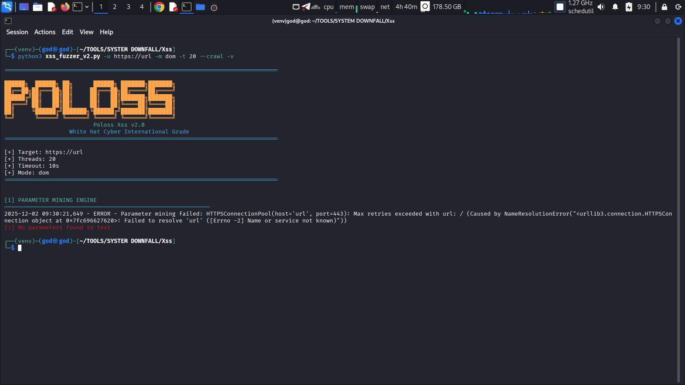

---

# **Poloss XSS Scanner v3.2**

### **Next-Generation Advanced XSS Detection Engine**

**BY POLOSS**

<p align="center">
  
</p>

---

## **⚡ Highlight Fitur v3.2**

* Engine parameter mining **tingkat lanjut** (URL, Form, Header, Cookie, JSON, File Upload)
* **Smart Context Analyzer** (HTML / JS / Attribute / URL / DOM)
* Database payload **> 2000+ payload aktif**
* Mutation engine (auto-bypass + auto-encode)
* **DOM XSS Full Sink Scanner**
* **Blind XSS Engine + Auto Callback Exfil**
* WAF detection (Cloudflare, AWS, ModSecurity, F5, Sucuri, dsb)
* Polyglot payload system
* Multi-thread turbo executor
* Real HTTP Injection (tanpa dummy, tanpa simulasi)
* Auto JSON report & log file
* Platform autodetect (WSL, Termux, Kali, Linux, macOS)

---

## **📥 Instalasi**

```bash
git clone -b O99099O-Update-V3.2 https://github.com/O99099O/Poloss_Xss
cd Poloss_Xss
pip install -r requirements.txt
```

**requirements.txt**

```
requests
beautifulsoup4
colorama
urllib3
lxml
```

---

## **🚀 Menjalankan Scanner**

### **Full Scan (default)**

```bash
python3 "Xss_main V3.2.py" -u https://target.com
```

### **Mode DOM**

```bash
python3 "Xss_main V3.2.py" -u https://target.com --mode dom
```

### **Fast Scan**

```bash
python3 "Xss_main V3.2.py" -u https://target.com --mode fast
```

### **Blind XSS**

```bash
python3 "Xss_main V3.2.py" -u https://target.com --blind-callback https://your-callback.net
```

### **Custom Headers**

```bash
python3 "Xss_main V3.2.py" -u https://target.com -H "Cookie:abc; User-Agent:POLOSS"
```

### **Boost Thread**

```bash
python3 "Xss_main V3.2.py" -u https://target.com --threads 20
```

---

## **📊 Output Scan**

Scanner menghasilkan:

```
xss_scan_XXXX.log
xss_report_XXXX.json
```

Berisi:

* Parameter ditemukan
* Payload yang dieksekusi
* Payload yang bypass
* WAF detection
* DOM Sink list
* Blind hit
* Full exploit detail

---

## **🧠 Mode Scan**

| Mode              | Fungsi                          |
| ----------------- | ------------------------------- |
| **fast**          | Cepat, fokus URL + Form         |
| **dom**           | Fokus DOM sink                  |
| **blind**         | Callback Blind XSS              |
| **comprehensive** | Semua parameter + payload penuh |

---

## **📡 Core Teknologi**

* Context-aware payload routing
* Adaptive mutation engine
* Multi-layer WAF bypass
* Real-time reflection tester
* Polyglot compiler injection
* DOM sink intelligence module

---

## **⚠️ Legal Notice**

Gunakan hanya pada target **legal & berizin**.
Semua risiko penyalahgunaan berada di tangan pengguna.

---

## **🖋️ Watermark**

**BY POLOSS**

---
